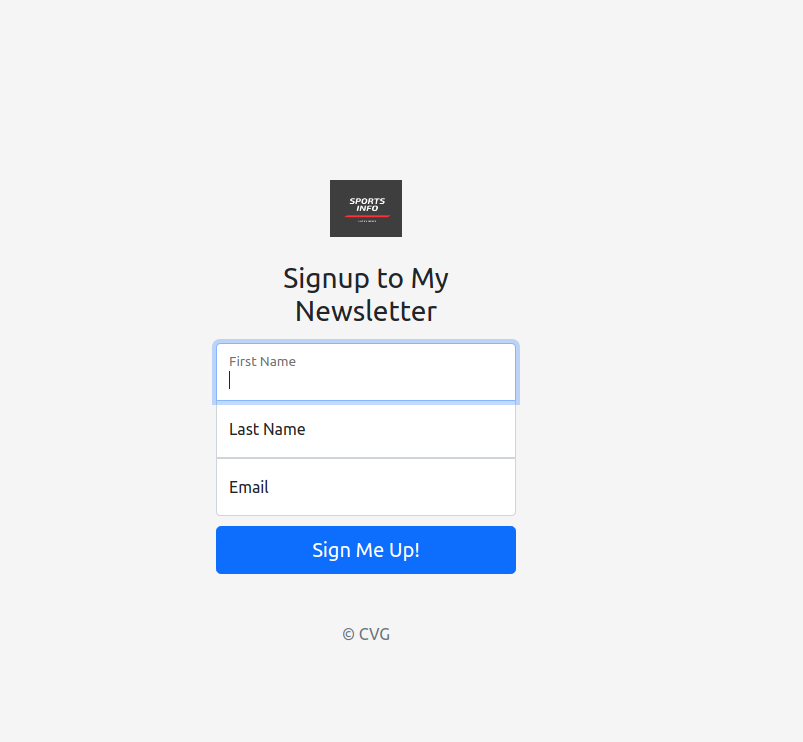

# Project: Newsletter

> Project was aboout creating a newsletter with NodeJS and ExpressJS

> 

## Built With

- CSS
- Javascript
- NodeJS
- ExpressJS

## Live Demo

[Live Demo Link](https://evening-brushlands-15893.herokuapp.com/)

## Getting Started

**To get a copy of the code please click on the green button on the top right corner that says Code**

### Prerequisites

- Node installed on your computer
- Npm as well
- Nodemon

### Install

**Now to clone it to your local machine please open your terminal and paste this code `git@github.com:cvilla714/newsletter-nodeandexpress.git`**

**Then you can go into the directory by typig `cd newsletter-nodeandexpress `**

**Finally just type this command `npm install` this will install all of the depnedecies for the project**

### Usage

**Once you have gone through the process of installing the code you now run this command `nodemon -r dotenv/config app.js` this will start the app and a new window will open in your browser with the app ready to be use**

### Deploy

**In order to Deploy the app to heroku follow the simple steps**

- First you need to make sure you have the latest version of your code in your github account
- Then you can run this command `heroku create` to create your app in heroku
- Last step is to push your code to heroku by running this command `git push heroku master`
- Now you can open you app by typing `heroku open`

## Authors

👤 **Cosmel Villalobos**

- Github: [@cvilla714](https://github.com/cvilla714)
- Twitter: [@kckeyti](https://twitter.com/kckeyti)
- LinkedIn: [Cosmel Villalobos](https://www.linkedin.com/in/cosvilla/)

## 🤝 Contributing

Contributions, issues, and feature requests are welcome!

Feel free to check the [issues page](https://github.com/cvilla714/newsletter-nodeandexpress/issues).

## Show your support

Give a ⭐️ if you like this project!

## 📝 License

This project is [MIT](https://github.com/cvilla714/calculator-react/blob/development/LICENSE) licensed.
